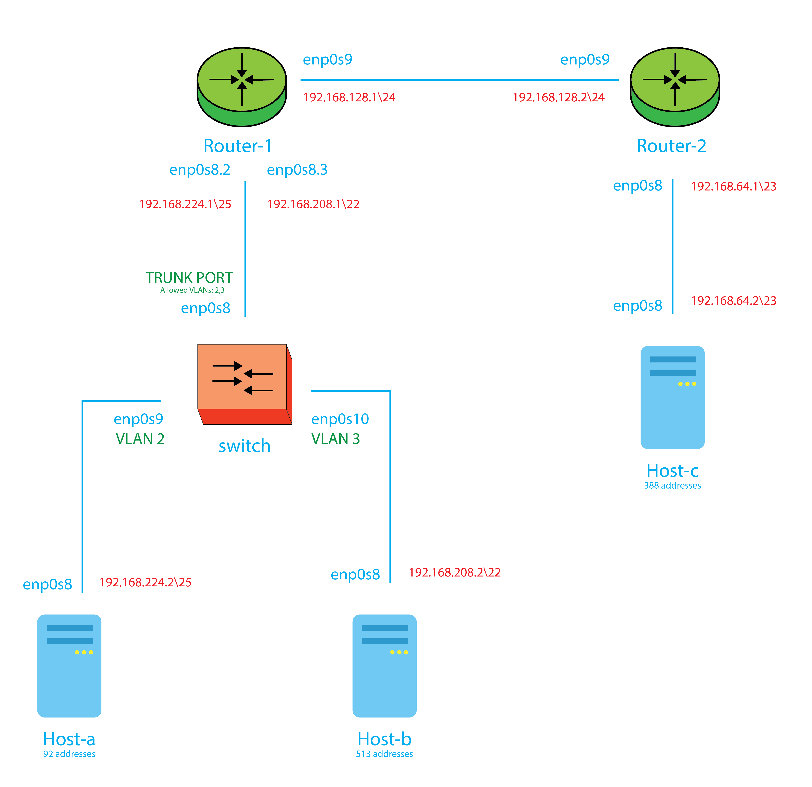

# DNCS-LAB

This repository contains the Vagrant files required to run the virtual lab environment used in the DNCS course.
```


        +-----------------------------------------------------+
        |                                                     |
        |                                                     |eth0
        +--+--+                +------------+             +------------+
        |     |                |            |             |            |
        |     |            eth0|            |eth2     eth2|            |
        |     +----------------+  router-1  +-------------+  router-2  |
        |     |                |            |             |            |
        |     |                |            |             |            |
        |  M  |                +------------+             +------------+
        |  A  |                      |eth1                       |eth1
        |  N  |                      |                           |
        |  A  |                      |                           |
        |  G  |                      |                     +-----+----+
        |  E  |                      |eth1                 |          |
        |  M  |            +-------------------+           |          |
        |  E  |        eth0|                   |           |  host-c  |
        |  N  +------------+      SWITCH       |           |          |
        |  T  |            |                   |           |          |
        |     |            +-------------------+           +----------+
        |  V  |               |eth2         |eth3                |eth0
        |  A  |               |             |                    |
        |  G  |               |             |                    |
        |  R  |               |eth1         |eth1                |
        |  A  |        +----------+     +----------+             |
        |  N  |        |          |     |          |             |
        |  T  |    eth0|          |     |          |             |
        |     +--------+  host-a  |     |  host-b  |             |
        |     |        |          |     |          |             |
        |     |        |          |     |          |             |
        ++-+--+        +----------+     +----------+             |
        | |                              |eth0                   |
        | |                              |                       |
        | +------------------------------+                       |
        |                                                        |
        |                                                        |
        +--------------------------------------------------------+


```

# Requirements
 - Python 3
 - 10GB disk storage
 - 2GB free RAM
 - Virtualbox
 - Vagrant (https://www.vagrantup.com)
 - Internet

# How-to
 - Install Virtualbox and Vagrant
 - Clone this repository
`git clone https://github.com/fabrizio-granelli/dncs-lab`
 - You should be able to launch the lab from within the cloned repo folder.
```
cd dncs-lab
[~/dncs-lab] vagrant up
```
Once you launch the vagrant script, it may take a while for the entire topology to become available.
 - Verify the status of the 4 VMs
 ```
 [dncs-lab]$ vagrant status                                                                                                                                                                
Current machine states:

router                    running (virtualbox)
switch                    running (virtualbox)
host-a                    running (virtualbox)
host-b                    running (virtualbox)
```
- Once all the VMs are running verify you can log into all of them:
`vagrant ssh router`
`vagrant ssh switch`
`vagrant ssh host-a`
`vagrant ssh host-b`
`vagrant ssh host-c`

# Assignment
This section describes the assignment, its requirements and the tasks the student has to complete.
The assignment consists in a simple piece of design work that students have to carry out to satisfy the requirements described below.
The assignment deliverable consists of a Github repository containing:
- the code necessary for the infrastructure to be replicated and instantiated
- an updated README.md file where design decisions and experimental results are illustrated
- an updated answers.yml file containing the details of your project

## Design Requirements
- Hosts 1-a and 1-b are in two subnets (*Hosts-A* and *Hosts-B*) that must be able to scale up to respectively 92 and 513 usable addresses
- Host 2-c is in a subnet (*Hub*) that needs to accommodate up to 388 usable addresses
- Host 2-c must run a docker image (dustnic82/nginx-test) which implements a web-server that must be reachable from Host-1-a and Host-1-b
- No dynamic routing can be used
- Routes must be as generic as possible
- The lab setup must be portable and executed just by launching the `vagrant up` command

## Tasks
- Fork the Github repository: https://github.com/fabrizio-granelli/dncs-lab
- Clone the repository
- Run the initiator script (dncs-init). The script generates a custom `answers.yml` file and updates the Readme.md file with specific details automatically generated by the script itself.
  This can be done just once in case the work is being carried out by a group of (<=2) engineers, using the name of the 'squad lead'.
- Implement the design by integrating the necessary commands into the VM startup scripts (create more if necessary)
- Modify the Vagrantfile (if necessary)
- Document the design by expanding this readme file
- Fill the `answers.yml` file where required (make sure that is committed and pushed to your repository)
- Commit the changes and push to your own repository
- Notify the examiner (fabrizio.granelli@unitn.it) that work is complete specifying the Github repository, First Name, Last Name and Matriculation number. This needs to happen at least 7 days prior an exam registration date.

# Notes and References
- https://rogerdudler.github.io/git-guide/
- http://therandomsecurityguy.com/openvswitch-cheat-sheet/
- https://www.cyberciti.biz/faq/howto-linux-configuring-default-route-with-ipcommand/
- https://www.vagrantup.com/intro/getting-started/


# Design
## Network diagram



Network is characterized by six devices. First of all, I assigned at every machine an IP addresses and a netmask.  
To do this, I had to respect the design requirements, in particular the number of usable addresses of every devices.  
In this part of work, I didn't consider *Switch*. Sure enough, *switch* works at L2 of tcp/ip stack, so it doesn't require an IP addresses.  
Moreover, I use the range of addresses by 192.168.0.0 to 192.168.255.255, because, like 10.0.0.0/18 and 172.16.0.0/12, can be used for private network and the selected range permit me to accommodate sufficently addresses.  
So I used:  

* **Host-a**  
Host-a needs to accommodate 92 addresses, so I assigned the netmask **255.255.255.128**. So I can connect to the netmask 2<sup>7</sup>-1 = 127 devices. Two devices are just assigned (*router-1* and *host-a*) so remain 125 free addresses. At this stage I could assign to *host-b* subnet the address **192.168.224.0/23** and to *host-c* **192.168.224.2**.
* **Host-b**  
Host-b needs to accommodate 513 addresses, so I assigned the netmask **255.255.252.0**. So *host-c* subnet support maximus 2<sup>10</sup>-1 = 1023 devices. Two devices are just assigned (*router-1* and *host-b*) so remain 1021 free addresses. So it was assigned to the subnet the address **192.168.208.0/22** and to *host-b* **192.168.208.2**.
* **Host-c**  
Host-c needs to accommodate 388 addresses, so I assigned the netmask **255.255.254.0**. With this netmask, in the *host-c* subnet can connect 2<sup>9</sup>-1 = 511 devices. Two devices are just assigned (*router-2* and *host-c*) so remain 509 free addresses. At this time, I decided that *host-c* subnet is **192.168.64.0/23** and to *host-c* is assigned **192.168.64.2**.
* **Router 2**  
Router-2 is linked to two subnet. One of this is the *host-c* subnet. In this subnet, *router-2*'s address is **192.168.64.1**.  
The other subnet represents the link with *router-1*, and in this I didn't have particular rules give by project to respect, so I decided to use a netmask **255.255.255.0**, with 2<sup>8</sup>-1 = 255 addresses. So, this subnet is represented by **192.168.128.0/24** and the *router-2*'s address is **192.168.128.2**.
* **Router 1**  
Router-1 is also link at two subnet. First of this is the link with *router-2*, and in this subnet it's address is **192.168.128.1**.
In the other one, there is a VLAN to divede port in two virtual subnet. So, enp0s8 (wich is the port name) are virtual splitted in two: enp0s8.2 and enp0s8.3. This can be made through a trunk port, wich allows more then one VLAN in the same port. Enp0s8.2 is connected to VLAN tag 2, so to the *host-a*'s subnet, and in this the *router-1*'s address is **192.168.224.1**. On the other side, enp0s8.3 is connected to VLAN tag 3, so to the *host-b*'s subnet, and in this the *router-1*'s address is **192.168.208.1**.

In the left part of the schematic, where is the *switch*, I opted for a VLAN. Sure enaugh, I had to manage a net where two devices can't speak toghether, but they was link to the same router and to the same switch. So the best way for me it's to use a VLAN.

## Devices configurations
For all devices I prepared script. In some case are invoked only to the firt start-up of machine, some other at every start up.
### Host-a
For host-a, I use only a script when machine is created.  
```bash
sudo apt update  
sudo ip link set enp0s8 up
echo "Host-A -> net set up..\n"
sudo /bin/su -c \
"cat << EOF > /etc/netplan/51-host-a-netConf.yaml
network:
   ethernets:
       enp0s8:
           dhcp4: false
           addresses: [192.168.224.2/25]
           routes:
           - to: 192.168.64.0/23
             via: 192.168.224.1
   version: 2
EOF
"
echo "Host-A -> static IP set..\n"
sudo netplan apply
echo "Host-A -> Route add..\n"
```
In this script, after the apt get update, is turning on the ethernet peripheral enp0s8, and it's created a yaml file, which contains all configurations of the network. At the end of sript, this file is applyed through "netplan apply" command.
Moreover, there is some control stamp made by "echo" command.
The yaml file name, which is save in /etc/netplan folder, is "51-host-a-netConf". This because in this method the yaml custom configuration file is execute after the default configuration file, which start with 50.
In this file I specify that the interface enp0s8 doesn't use dhcp service, the IP in this interface is 192.168.224.2, the netmask is 255.255.255.128 (/25), and the I specify the routing table.
On the routing table I declare that all packets which interestig subnet 192.168.64.0/23, so the host-c subnet, are send to router-1 (192.168.224.1), and when are here they're manage by router-1 routing table.

### Host-b
For host-b, like for host-a, I use only a script when machine is created.  
```bash
sudo apt update
sudo ip link set enp0s8 up
echo "Host-B -> net set up..\n"
sudo /bin/su -c \
"cat << EOF > /etc/netplan/51-host-b-netConf.yaml
network:
   ethernets:
       enp0s8:
           dhcp4: false
           addresses: [192.168.208.2/22]
           routes:
           - to: 192.168.64.0/23
             via: 192.168.208.1
   version: 2
EOF
"
echo "Host-B -> static IP set..\n"
sudo netplan apply
echo "Host-B -> Route add..\n"
```
This script is so similar to host-a's script, so for explanation I resend to host-a section.  
The few things those change are the IP address, which is 192.168.208.2 for host-b, and the address of gateway for the ruting map.  
Note that host-a and host-b are in two different VLAN, but they don't know.

### Host-c
Host-c needs two script, one similar to Host-a and host-b which is executed only in the first startup of machine, and one other is executed at every Startup of pc for activate docker service.
```bash
sudo apt update
sudo apt install -y docker.io
sudo ip link set enp0s8 up
echo "Host-C -> net set up..\n"
sudo /bin/su -c \
"cat << EOF > /etc/netplan/51-host-c-netConf.yaml
network:
   ethernets:
       enp0s8:
           dhcp4: false
           addresses: [192.168.64.2/23]
           routes:
           - to: 192.168.208.0/22
             via: 192.168.64.1
           - to: 192.168.224.0/25
             via: 192.168.64.1
   version: 2
EOF
"
echo "Host-C -> static IP set..\n"
echo "Host-C -> Route add..\n"
sudo netplan apply
```
This script is executed only at first turning on of machine.
After apt update and the installation of docker, is activated enp0s8 interface and is created the yaml network configuration file.
In this file I specify that the selected interface, enp0s8, doesn't use dhcp, use the IP address 192.168.64.1 and the netmask 255.255.254.0 (/23), and is specify routing table.
In this table, I illustrated that for send a packet on host-a or host-b subnet, must pass through router-2.
```bash
sudo docker run -it --rm -d -p 8080:80 --name webServer dustnic82/nginx-test
echo "Host-C -> webServer run..\n"
```
In this second script, which is execute at every machine startup, is activate docker webServer.

### Switch
Like host-c, also switch require two script those are invoked in the same method.  
<br>
```bash
sudo /bin/su -c "echo 'net.ipv4.ip_forward = 1' >> /etc/sysctl.conf"
sudo sysctl -p /etc/sysctl.conf
echo "Switch -> IP packet forward active..\n"
sudo ovs-vsctl add-br my_bridge
sudo ovs-vsctl add-port my_bridge enp0s8
sudo ovs-vsctl add-port my_bridge enp0s9 tag=2
sudo ovs-vsctl add-port my_bridge enp0s10 tag=3
echo "Switch -> Port assign to VLAN..\n"
```
The first script, which is call at first machine startup, do two things: firstable, enables the IP packet forwarding, and after create a switch.  
To enable ip packet forwarding is adding to /etc/sysctl.conf a line with a specific command, and this is made in the second row of code, and after applies the new configuration thanks the third line of code. This is made because ubuntu, with her default configuration, doesn't permit the forwarding of receving packets.  
after enable this configuration, machine is ready to became a switch thanks openvswitch packet. So, in line 4, after a firstable control stamp, I create a new bridge, so a entity that work at layer two and sort packets, and, in the next row, I add the three network interface to "my_bridge". I add enp0s8, which is the port connect to router-1, like trunked port, so "my_bridge" forward packet of all VLAN, so I add enp0s9, which is link to host-a, with VLAN tag 2, so it becames a part of VLAN 2, and finally I add enp0s10, connect with host-b, to VLAN 3.  
<br>
```bash
sudo ip link set enp0s8 up
sudo ip link set enp0s9 up
sudo ip link set enp0s10 up
```
The second script, call automatically at every startup of machine, needs only to activated the different network interface.  

### Router-1
The router needs the most important part of code. Tere are to script for each router, and these permit to have the comunication between the two subnets.  
<br>
```bash
sudo apt update
sudo apt install vlan
sudo /bin/su -c "echo 'net.ipv4.ip_forward = 1' >> /etc/sysctl.conf"
sudo sysctl -p /etc/sysctl.conf
echo "Router-1 -> net set up..\n"
sudo /bin/su -c \
"cat << EOF > /etc/netplan/51-router-1-netConf.yaml
network:
   ethernets:
       enp0s8.2:
           dhcp4: false
           addresses: [192.168.224.1/25]
       enp0s8.3:
           dhcp4: false
           addresses: [192.168.208.1/22]
       enp0s9:
           dhcp4: false
           addresses: [192.168.128.1/24]
           routes:
           - to: 192.168.64.0/23
             via: 192.168.128.2
   version: 2
EOF
"
echo "Router-1 -> static IP set..\n"
sudo netplan apply
echo "Router-1 -> Route add..\n"
```
In the first code, which are invok only the first time, I install vlan packet, necessary to virtual split enp0s8 in two virtual interface, I enable ip packet forwarding, like in switch, abd after configure the netplan.yaml file.  
Here, I choose the ip address of device for each interface and for enp0s9 I add to routing table the instruction to manage the host-c-subnet destination packages. Sure enaugh, if arrive a packet with destiation 192.168.64.0, it be sending to 192.168.128.2, so to the router-2.  
After this, I apply the new configuration whith "netplan apply" command.
<br>
```bash
sudo modprobe 8021q
sudo vconfig add enp0s8 2
sudo vconfig add enp0s8 3
sudo ip link set enp0s8 up
sudo ip link set enp0s8.2 up
sudo ip link set enp0s8.3 up
sudo ip link set enp0s9 up
```
In this second script it's manage the VLAN and bringing up port.  
With the first command, it's enable the vlan standard to read and send ip packet.  
with the second and the third row, instead, it's be splitted the enp0s8 interface in two virtual interface, one for vlan 2 and the other for vlan 3.
With the next row are activate all network interface.  
### Router-2
The router-2 manage the communication of host-c subnet with left part of net. Here there is ony two port, sure enaugh there isn't a split give by VLAN, so need only a script to works.
```bash
sudo apt update
sudo ip link set enp0s8 up
sudo ip link set enp0s9 up
sudo /bin/su -c "echo 'net.ipv4.ip_forward = 1' >> /etc/sysctl.conf"
sudo sysctl -p /etc/sysctl.conf
echo "Router-2 -> net set up..\n"
sudo /bin/su -c \
"cat << EOF > /etc/netplan/49-router-2-netConf.yaml
network:
   ethernets:
       enp0s8:
           dhcp4: false
           addresses: [192.168.64.1/23]
       enp0s9:
           dhcp4: false
           addresses: [192.168.128.2/24]
           routes:
           - to: 192.168.224.0/25
             via: 192.168.128.1
           - to: 192.168.208.0/22
             via: 192.168.128.1
   version: 2
EOF
"
echo "Router-2 -> static IP set..\n"
sudo netplan apply
echo "Router-2 -> Route add..\n"
```
Like other scripts, in this script firstable launch apt update, after that bringing up the two network interface and so enable ip packet forwarding and set addresses and routing table through to yaml configuration file.
in this case was setting in enp0s8 the address 192.168.64.1, sure enaugh it be the router for host-c's subnetwork, and in enp0s9 the address 192.168.128.2. The routing table of this device specify that packets with destiation 192.168.208.0 or 192.168.214.0 have to be send to router-1.
